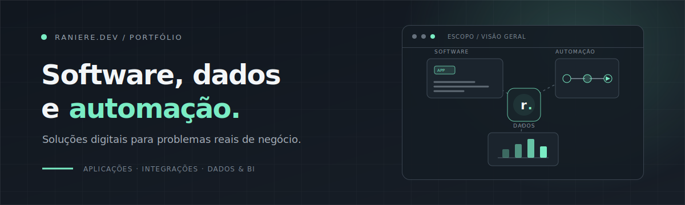

 

## Software, automaùùo e dados no mesmo fluxo.

Sou **Raniere Rodrigues Gomes**. Crio aplicaùùes, integraùùes, automaùùes e soluùùes de dados para transformar necessidades reais em ferramentas ùteis no dia a dia.

 

> Disponùvel para novos projetos

---

#### 01 / Serviùos

| Frente | Foco |
| :--- | :--- |
| **Desenvolvimento de software** | Web ù iOS & Android ù Desktop |
| **Automaùùes e integraùùes** | Integraùùes ù Rotinas automùticas ù Webhooks |
| **APIs e sistemas internos** | API design ù ERP / CRM ù Back-office |
| **Business Intelligence** | Dashboards ù KPIs ù Self-service BI |
| **Engenharia de dados** | ETL / ELT ù Data warehouse ù Modelagem |
| **Deploy e infraestrutura** | Linux ù Containers ù CI/CD |

---

#### 02 / Projetos

| Projeto | Demo | Cùdigo |
| :--- | :--- | :--- |
| **Sigma** ù atendimento com IA | [demo](https://raniere.dev/sigma/) | [repo](https://github.com/raniere57/raniere-dev/tree/main/sigma) |
| **Sentinel QA** ù monitoria de atendimentos | [demo](https://raniere.dev/sentinel/) | [repo](https://github.com/raniere57/raniere-dev/tree/main/sentinel) |
| **InsightGate** ù portal Power BI | [demo](https://raniere.dev/insightgate/) | [repo](https://github.com/raniere57/raniere-dev/tree/main/insightgate) |
| **DataForge** ù pipelines de dados | [demo](https://raniere.dev/dataforge/) | [repo](https://github.com/raniere57/raniere-dev/tree/main/dataforge) |

Mais cases e demonstraùùes em **[raniere.dev](https://raniere.dev/#projetos)**.

---

#### 03 / Como o trabalho acontece

**Problema primeiro** ù tecnologia ù meio. Antes de qualquer linha de cùdigo, o processo, o gargalo e o resultado esperado sùo mapeados.

**Simples e sustentùvel** ù a melhor soluùùo ù a que a equipe consegue operar amanhù. Sem complexidade desnecessùria.

**Dados confiùveis** ù dashboard bonito com nùmero errado ù pior que planilha. Qualidade e rastreabilidade vùm antes da estùtica.

---

#### 04 / Stack

  
<b>Mais ferramentas</b>

   
  

---

#### GitHub

---

**Tem um processo manual, um dado preso ou dois sistemas que nùo conversam?**

[Iniciar conversa](mailto:raniere57@icloud.com) ù [raniere.dev](https://raniere.dev)

 

